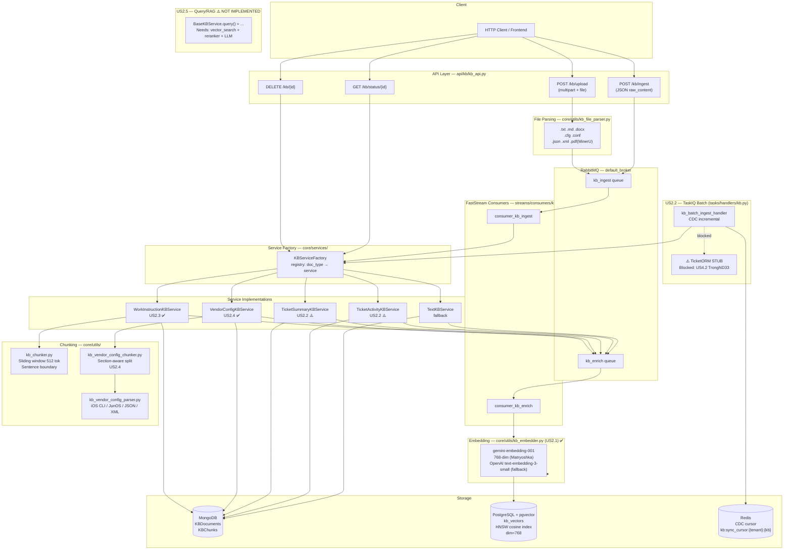
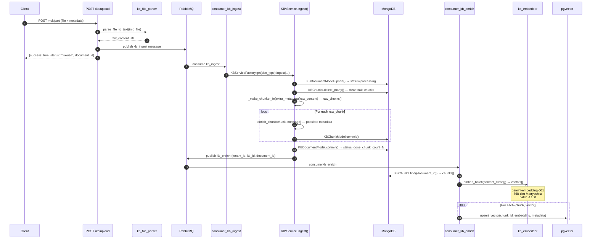
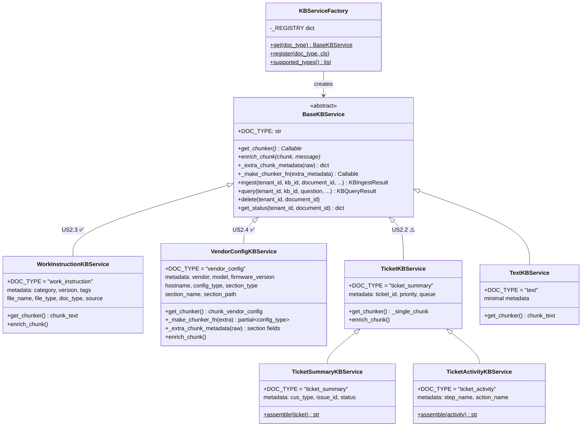
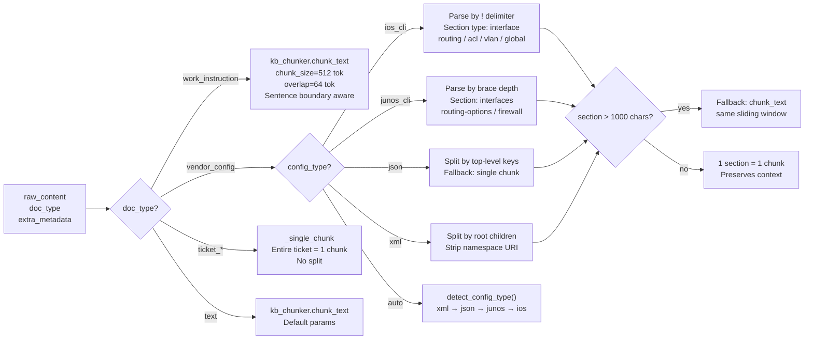
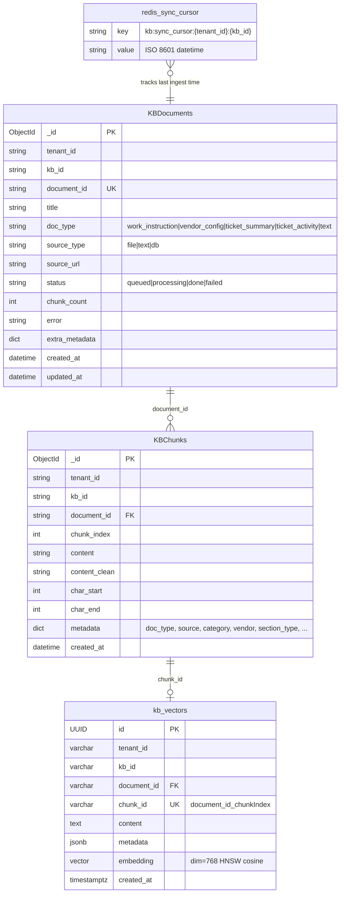
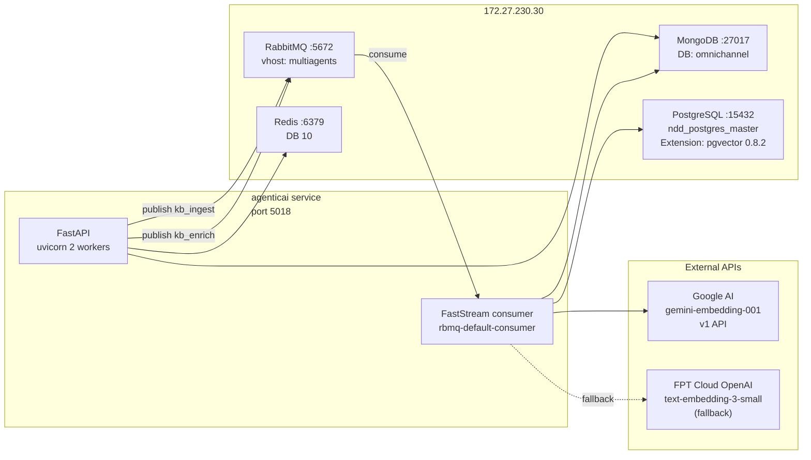

# KB Pipeline Architecture — US2.1 → US2.4

> **Backlinks:** [CLAUDE.md](../../CLAUDE.md) | [system-overview.md](../architecture/system-overview.md) | [streams.md](../architecture/streams.md)

*Tech Lead Review — Cập nhật: 2026-05-18*

---

## 1. System Architecture Overview

---

## 2. Ingest Pipeline — Sequence Diagram

---

## 3. Service Layer — Class Diagram

---

## 4. Chunking Strategy — Decision Tree

---

## 5. Data Models

---

## 6. US Status Summary

| US | Tên | Components chính | Status | Blocker |
|----|-----|-----------------|--------|---------|
| **US2.1** | Embedding Pipeline | `kb_embedder.py` · `kb_vectors.py` · `pgvector_client.py` · `kb_enrich_handler` | ✅ Done | — |
| **US2.2** | Ticket Batch Ingest | `kb_batch_ingest_handler` · `kb_sync_cursor.py` · `TicketSummaryKBService` | ⚠️ Stubbed | `TicketORM` — US4.2 (TrongND33) |
| **US2.3** | Work Instruction KB | `WorkInstructionKBService` · `kb_chunker.py` · `kb_file_parser.py` | ✅ Done | — |
| **US2.4** | Vendor Config KB | `VendorConfigKBService` · `kb_vendor_config_chunker.py` · `kb_vendor_config_parser.py` | ✅ Done | — |
| **US2.5** | Query / RAG | `BaseKBService.query()` · `vector_search()` | ❌ Not impl | Reranker + LLM (next sprint) |

---

## 7. Infrastructure Dependencies

